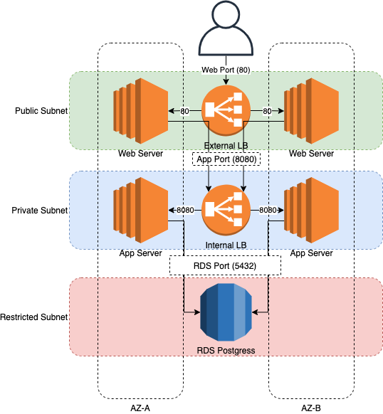
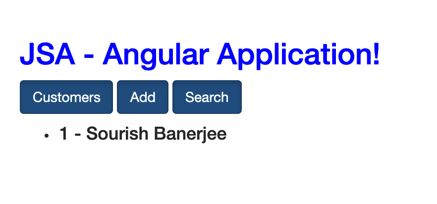

# DevOps Tech Challenge

This repository contains solutions to provided challenges. Solutions for each challenge is described below.

## Challenge 1
### Problem Statement
A 3 tier environment is a common setup. Use a tool of your choosing/familiarity create these resources. Please remember we will not be judged on the outcome but more focusing on the approach, style and reproducibility.
### Solution
The requirement is to setup 3 tier environment which can be easily reproduced multiple times. For example, building Dev and Test environments which should be aligned to each other w.r.t infrastructure for proving better test results. Terraform is widely used standard tool for documenting Infrastructure as Code. Terraform will solve the probelem of creating a reproducible environment as well as version controlling each change being made in the infrastructure.

So, here I have used AWS as a cloud platform where I am creating 3 tier infrastruture and running an application on it. 3 tier envirments 3 main components suc has web sever, application server and database. As a standard practice, this kind of environments are built on 3 types of subnets based on the restrictions which are as mentioned below:

1. Public Subnet - This will be the public subnet which is facing the end user and is open to internet through internet gate. This subnet is less secure since it is internet facing vulnerable to attacks. Hence, this is being used only to deploy the web server

2. Private Subnet - Private is is more secured subnet which will not be facing the internet. Which means it will use NAT Gateway to only send request to internet. This is restricts all the traffic coming directly from internet. Hence, will be used to application server which will only recieve traffic only via public subnet above using secured internal private network of AWS Cloud.

3. Restrcited/Database subnet - This subnet is the most secured subnet without any NAT gateway as well as Internet Gateway. We will use this subnet to deploy database which will hold the critical user data.

The high level architecture is shown below:


Here are the steps to deploy aboe architecture using terraform on AWS Cloud.

<b><u>Pre-requisites</u></b>
1. Create openSSH Key in your home directory (~/.ssh/id_rsa) using following command

`ssh-keygen -t rsa -b 4096 -C "Enter you comment"`

2. Install AWS CLI and setup your AWS access key and secret key

`aws config`

3. Create S3 bucket for storing tfstate file. Name it as 'tf-dev-state-bucket-1'.

4. Install terraform CLI.

5. Create DynomoDB table called 'tf-dev-state-lock' with the key called 'LockID'.

<b><u>Apply terraform:</u></b>

Step-1: Clone this git repository
`git clone https://github.com/sourish88/KDO-TChlng.git`

Step-2: Run below command to to initialise terraform

`cd Challenge-1`

`terraform init`

Step-3: Run below command to generate terraform plan for the changes

`terraform plan -var-file="env/dev.tfvars" --var db_username=<ENTER USERNAME> --var db_password=<ENTER PASSWORD> -out tfplan.out`

Step-4: Validate your changes in the generated TF Plan

`terraform show tfplan.out`

Step-5: Once you are happy with the changes shown in TF plan, run below to apply the generated plan

`terraform apply tfplan.out`

<b><u>Test Application</b></u>
It is a simple Angular Application which stores the Customer entry in RDS database and shows list of customers currently added in database. Login to AWS console and find the DNS Name of 'dev-elb-web' loadbalancer. Paste the DNS name in the browser which will present you this page:


Try and add your firstname and last name. Then click on 'Customers' button and check if you can see your name listed. Also, try and search your last name to get your full name.

## Challenge 2
### Problem Statement
We need to write code that will query the meta data of an instance within aws and provide a json formatted output. The choice of language and implementation is up to you.

### Solution
Instance metadata is accessible from AWS Instance it self via the URL http://169.254.169.254/latest/meta-data/. I have used a python script to fetch this metadata from the instance and output the same converted in json format. To facilitate the requirement for uer to select specific key value, I have wrapped in a shell which provides user input prompt for required keys.

<b><u>Pre-requisites</u></b>

1. Install python 2.7 and above
2. Install jq

<b><u>Execution</b></u>

Step-1: Clone this git repository on the required instance

`git clone https://github.com/sourish88/KDO-TChlng.git`

Step-2: Execute shell wrapper

`cd Challenge-2`
`./getInstMeta.sh`

Step-3: Now you will be given list of metadata keys avaialable of the instance. 

```
Below is the list of available metadata keys for this intsance:
[
  "ami-id",
  "ami-launch-index",
  "ami-manifest-path",
  "block-device-mapping",
  "events",
  "hostname",
  "identity-credentials",
  "instance-action",
  "instance-id",
  "instance-life-cycle",
  "instance-type",
  "local-hostname",
  "local-ipv4",
  "mac",
  "metrics",
  "network",
  "placement",
  "profile",
  "public-hostname",
  "public-ipv4",
  "public-keys",
  "reservation-id",
  "security-groups",
  "services"
]
```

Step-4: Enter the required keyname and press ENTER to get the result

```
Enter key name from above list: network
{
  "interfaces": {
    "macs": {
      "06:5e:52:26:c9:bc": {
        "local-hostname": "ip-10-0-101-34.eu-west-2.compute.internal",
        "security-groups": "dev-web-sg",
        "public-hostname": "",
        "vpc-ipv4-cidr-blocks": "10.0.0.0/16",
        "subnet-id": "subnet-06dae7cfbcd72e932",
        "public-ipv4s": "18.130.227.120",
        "interface-id": "eni-0be5d828a9a9fcf12",
        "mac": "06:5e:52:26:c9:bc",
        "security-group-ids": "sg-0e9890f7df19b3d12",
        "vpc-ipv4-cidr-block": "10.0.0.0/16",
        "owner-id": "072132828108",
        "local-ipv4s": "10.0.101.34",
        "subnet-ipv4-cidr-block": "10.0.101.0/24",
        "vpc-id": "vpc-09e50608f10b6e923",
        "device-number": 0,
        "ipv4-associations": {
          "18.130.227.120": "10.0.101.34"
        }
      }
    }
  }
}
```